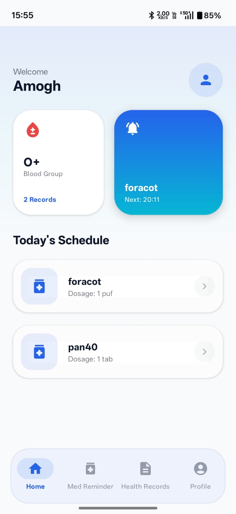
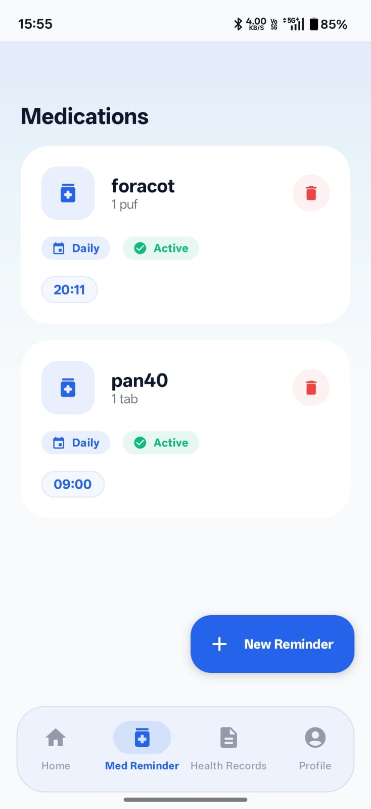
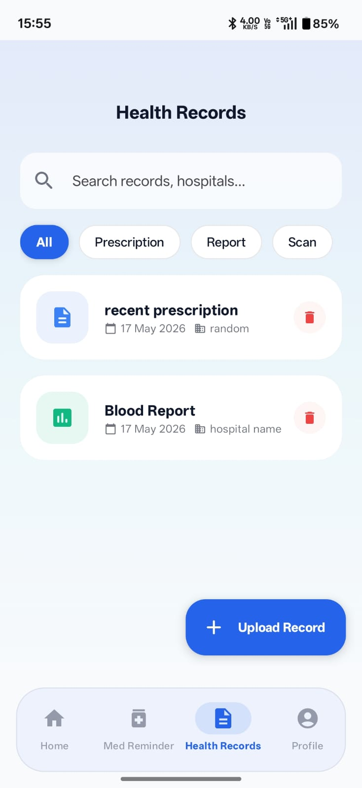
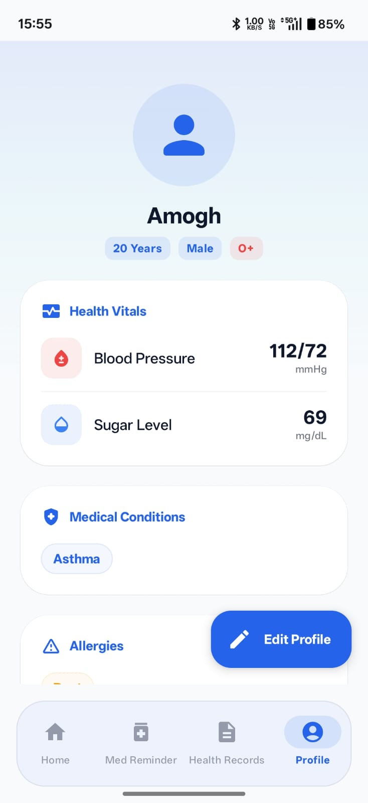

# CarePulse 🏥
**Your Health, Our Responsibility**

CarePulse is a modern, comprehensive medical management application built to help patients stay on top of their health journey. With a focus on ease of use and premium aesthetics, CarePulse simplifies medication adherence and medical record keeping.

---

## ✨ Key Features

- **🚀 Personalized Onboarding**: A smooth, 4-step personalized setup to capture basic info, conditions, vitals, and allergies.
- **💊 Smart Medication Reminders**: 
  - Advanced scheduling (Daily, Alternate Days, Weekly).
  - Multiple time slots per medicine.
  - Persistent alarms that survive device reboots.
  - Real-time status tracking (Active, Paused, Expired).
- **📂 Medical Record Vault**: 
  - Upload and categorize medical documents (Prescriptions, Scans, Reports).
  - Full support for **Image** and **PDF** formats.
  - Category-based filtering and instant search.
- **📊 Vitals Tracking**: 
  - Monitor core health metrics like Blood Pressure (mmHg) and Sugar Levels (mg/dL).
  - Quick-view health summary cards on the home dashboard.
- **🎨 Premium UI/UX**: 
  - Dynamic mesh gradients and modern card layouts.
  - Fully optimized for **Dark Mode**.
  - Smooth, branded animated splash screen.

---

## 📸 Screenshots

|                     Home Dashboard                     |                      Medication Schedule                       |                          Health Records                          |                       User Profile                        |
|:------------------------------------------------------:|:--------------------------------------------------------------:|:----------------------------------------------------------------:|:---------------------------------------------------------:|
|  |  |  |  |

---

## 🛠️ Technical Stack

- **Language**: Kotlin
- **UI Framework**: Jetpack Compose (100% Declarative UI)
- **Architecture**:  MVI (Model-View-Intent) / MVVM with Unidirectional Data Flow (UDF).
- **Dependency Injection**: Hilt
- **Local Database**: Room
- **Navigation**: Compose Navigation
- **Image Loading**: Coil
- **Background Tasks**: AlarmManager + BroadcastReceivers
- **Theme**: Material 3 with Dynamic Color support

---

## 📦 Download & Installation

The initial release **CarePulse v1.0.0** is now available.

1. Navigate to the **Releases** section of this repository.
2. Download the **`app-debug.apk`**.
3. Enable "Install from Unknown Sources" in your Android settings.
4. Open the APK to install.

---

## ⚙️ How to Build

1. **Clone the project**: git clone https://github.com/Amogh-0201/CarePulse.git
2. **Open in Android Studio**: Use Android Studio Ladybug (2024.2.1) or newer.
3. **Sync Gradle**: Allow the project to download all necessary dependencies.
4. **Run**: Connect an Android device or emulator (API 26+) and click **Run**.

---

## 🛡️ License

This project is licensed under the MIT License - see the [LICENSE](LICENSE) file for details.

---
*Developed with ❤️ by Amogh*
   
